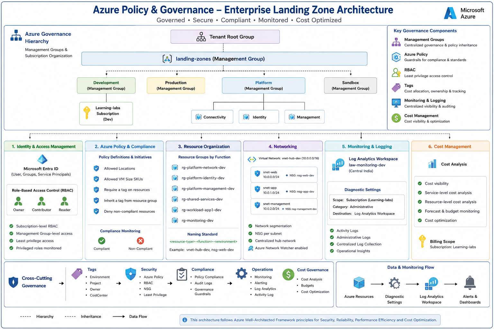

# Azure Policy & Governance Lab

Hands-on Azure Policy, Governance and resource management lab implemented using Microsoft Azure.

## 🎯 Objectives

- Design and implement Azure Management Group hierarchy
- Organize Azure subscriptions using Management Groups
- Implement Azure Policy for governance and compliance
- Configure policy assignments at subscription and resource scopes
- Enforce resource tagging standards
- Implement resource naming and governance standards
- Configure Azure RBAC and least-privilege access
- Implement Azure Resource Locks
- Configure Azure Monitor and Log Analytics
- Monitor Azure Activity Logs and policy actions
- Validate policy compliance and governance controls
- Implement cost governance and resource management best practices

## 🏗️ Lab Architecture

## 🛠️ Technologies

- Microsoft Azure
- Azure Resource Manager
- Azure Management Groups
- Azure Subscriptions
- Azure Policy
- Policy Definitions
- Policy Assignments
- Policy Compliance
- Azure Resource Groups
- Resource Tags
- Azure RBAC
- Azure Resource Locks
- Azure Monitor
- Azure Activity Log
- Log Analytics
- Azure Cost Management

## 🔐 Key Implementations

| Area | Hands-on Implementation |
|---|---|
| Management Hierarchy | Management Groups and Subscription Organization |
| Governance | Azure Policy Definitions and Assignments |
| Compliance | Policy Compliance Evaluation and Validation |
| Resource Standards | Resource Naming and Mandatory Tagging |
| Access Control | Azure RBAC and Least Privilege |
| Resource Protection | Azure Resource Locks |
| Monitoring | Azure Activity Logs and Azure Monitor |
| Centralized Logging | Log Analytics Workspace |
| Cost Governance | Azure Cost Analysis and Resource Governance |
| Validation | Policy Enforcement and Governance Testing |

## 📸 Hands-on Evidence

The `Screenshots` folder contains implementation evidence covering:

- Management Group hierarchy
- Subscription organization
- Azure Policy assignments
- Policy compliance
- Policy enforcement
- Resource tagging
- Resource naming standards
- Azure RBAC
- Resource Locks
- Resource Groups
- Azure Activity Logs
- Azure Monitor
- Log Analytics Workspace
- Cost Analysis
- Governance validation

## 📚 Documentation

Detailed implementation notes are available in the `Implementation` folder.

- [Management Group Hierarchy](Implementation/Management-Group-Hierarchy.md)
- [Azure Policy](Implementation/Azure-Policy.md)
- [Policy Compliance](Implementation/Policy-Compliance.md)
- [Resource Governance](Implementation/Resource-Governance.md)
- [RBAC & Access Control](Implementation/RBAC.md)
- [Resource Locks](Implementation/Resource-Locks.md)
- [Monitoring & Activity Logs](Implementation/Monitoring.md)
- [Cost Governance](Implementation/Cost-Governance.md)

## 🎓 Skills Demonstrated

**Azure Policy • Azure Governance • Management Groups • Policy Compliance • Resource Tagging • Azure RBAC • Resource Locks • Azure Monitor • Log Analytics • Activity Logs • Cost Governance • Cloud Security**

## 📌 Project Status

**Completed**

Hands-on implementation, validation, governance testing and documentation completed using Microsoft Azure.
